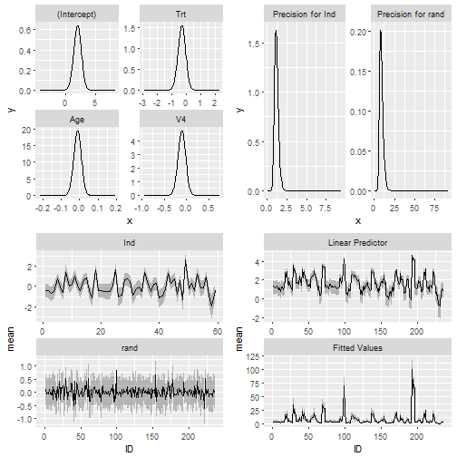
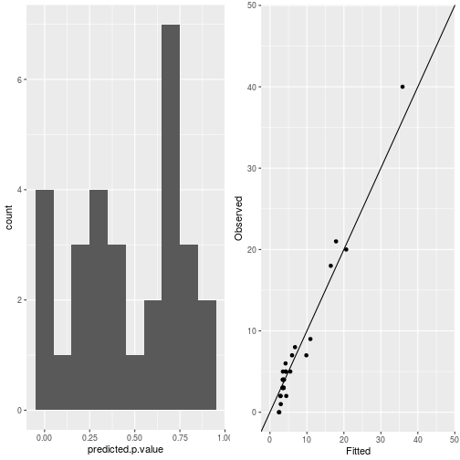
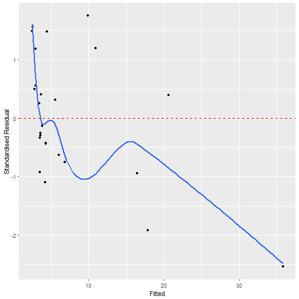
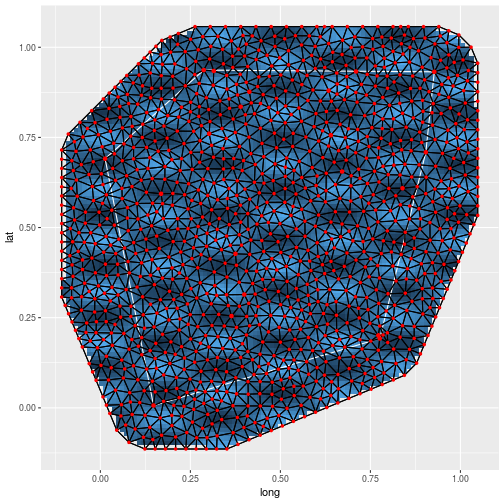
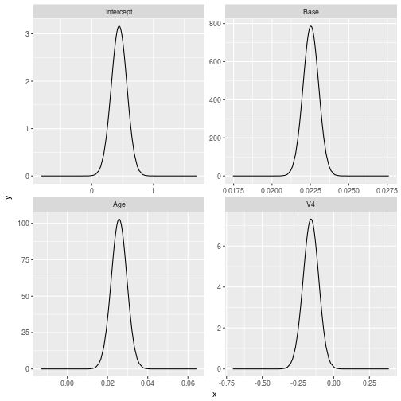
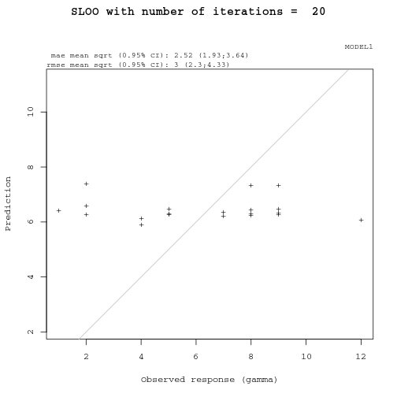
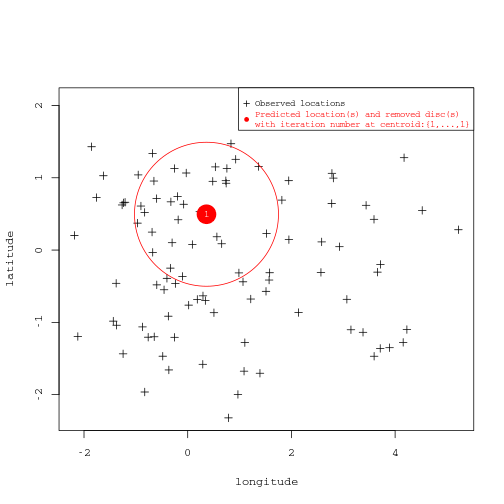

INLAutils
==========

[](https://travis-ci.org/timcdlucas/INLAutils)
[](https://codecov.io/github/timcdlucas/INLAutils?branch=master)
[](https://cran.rstudio.com/web/packages/INLAutls) 


A package containing utility functions for the `R-INLA` package.

There's a fair bit of overlap with [inlabru](http://www.github.com/fbachl/inlabru).


Installation
-------------

To install, first install `INLA`.


```r
install.packages("INLA", repos="https://www.math.ntnu.no/inla/R/stable")
```

then install `INLAutils`


```r
# From CRAN
install.packages('INLAutils')

# From github
library(devtools)
install_github('timcdlucas/INLAutils')

# Load packages
library(INLA)
library(INLAutils)
```


Overview
--------


### Plotting


I find the the `plot` function in `INLA` annoying and I like `ggplot2`.
So `INLAutils` provides an `autoplot` method for INLA objects.


```r
      data(Epil)
      ##Define the model
      formula = y ~ Trt + Age + V4 +
               f(Ind, model="iid") + f(rand,model="iid")
      result = inla(formula, family="poisson", data = Epil, control.predictor = list(compute = TRUE))
     
      autoplot(result)
```




There is an autoplot method for INLA SPDE meshes.


```r
    m = 100
    points = matrix(runif(m * 2), m, 2)
    mesh = inla.mesh.create.helper(
      points = points,
      cutoff = 0.05,
      offset = c(0.1, 0.4),
      max.edge = c(0.05, 0.5))
    
    autoplot(mesh)
```


There are functions for plotting more diagnostic plots.


```r
 data(Epil)
 observed <- Epil[1:30, 'y']
 Epil <- rbind(Epil, Epil[1:30, ])
 Epil[1:30, 'y'] <- NA
 ## make centered covariates
 formula = y ~ Trt + Age + V4 +
          f(Ind, model="iid") + f(rand,model="iid")
 result = inla(formula, family="poisson", data = Epil,
               control.predictor = list(compute = TRUE, link = 1))
 ggplot_inla_residuals(result, observed, binwidth = 0.1)
```



```r
 ggplot_inla_residuals2(result, observed, se = FALSE)
```

```
## `geom_smooth()` using method = 'loess'
```



Finally there is a function for combining shapefiles, rasters (or INLA projections) and meshes.
For more fine grained control the geoms defined in [inlabru](http://www.github.com/fbachl/inlabru) might be useful.


```r
# Create inla projector
n <- 20
loc <- matrix(runif(n*2), n, 2)
mesh <- inla.mesh.create(loc, refine=list(max.edge=0.05))
projector <- inla.mesh.projector(mesh)

field <- cos(mesh$loc[,1]*2*pi*3)*sin(mesh$loc[,2]*2*pi*7)
projection <- inla.mesh.project(projector, field)

# And a shape file
crds <- loc[chull(loc), ]
SPls <- SpatialPolygons(list(Polygons(list(Polygon(crds)), ID = 'a')))

# plot
ggplot_projection_shapefile(projection, projector, SPls, mesh)
```



### Analysis

There are some helper functions for general analyses.


`INLAstep` runs stepwise variable selection with INLA.


```r
  data(Epil)
  stack <- inla.stack(data = list(y = Epil$y),
                      A = list(1),
                      effects = list(data.frame(Intercept = 1, Epil[3:5])))
                      
  result <- INLAstep(fam1 = "poisson", 
                     Epil,
                     in_stack = stack,
                     invariant = "0 + Intercept",
                     direction = 'backwards',
                     include = 3:5,
                     y = 'y',
                     y2 = 'y',
                     powerl = 1,
                     inter = 1,
                     thresh = 2)
  
  result$best_formula
```

```
## y ~ 0 + Intercept + Base + Age + V4
## <environment: 0x15c3ffe0>
```

```r
  autoplot(result$best_model, which = 1)
```




`makeGAM` helps create a function object for fitting GAMs with INLA.


```r
 data(Epil)
 formula <- makeGAM('Age', invariant = '', linear = c('Age', 'Trt', 'V4'), returnstring = FALSE)
 formula
```

```
## y ~ +Age + Trt + V4 + f(inla.group(Age), model = "rw2")
## <environment: 0x15024960>
```

```r
 result = inla(formula, family="poisson", data = Epil)
```

### Spatial leave-one-out cross-validation (sloo-cv)

The package `INLAutils` provides an approach to run sloo-cv for INLA objects.


```r
# generate a dataframe and INLA output for the function
set.seed(10)
coords <- data.frame(long = c(rnorm(70), rnorm(30, 3)), lat = rnorm(100))
PA <- rep(c(0, 1), each = 50)
x <- data.frame(x1 = rnorm(100), x2 = c(rnorm(70), rnorm(30, 2)))# x1 no relat., x2 pos. relat.
dataf1 <- sp::SpatialPointsDataFrame(coords = coords, data = data.frame(y = PA, x))
mesh <- INLA::inla.mesh.2d(loc = sp::coordinates(dataf1), max.edge = c(3, 3),cutoff = 1.3)
spde <- INLA::inla.spde2.matern(mesh, alpha=2)#SPDE model is defined
A <- INLA::inla.spde.make.A(mesh, loc = sp::coordinates(dataf1))#projector matrix
dataframe <- data.frame(dataf1) #generate dataframe with response and covariate
modform<-stats::as.formula(paste('y ~ -1+ x1 + x2 + y.intercept + f(spatial.field, model=spde)'))
stk <- INLA::inla.stack(data=list(y=dataframe$y),A=list(A, 1),
effects=list(list(spatial.field=1:spde$n.spde),
list(y.intercept=rep(1,length(dataframe$y)),covariate=dataframe[c(-1)])),tag='est')
out <- INLA::inla(modform, family='normal',Ntrials = 1, data=INLA::inla.stack.data(stk, spde=spde),
                  control.predictor = list(A=INLA::inla.stack.A(stk),link=1),
                  control.compute = list( config=TRUE),control.inla = list(int.strategy='eb'))
out.field <- INLA::inla.spde2.result(out,'spatial.field', spde, do.transf=TRUE)
range.out <- INLA::inla.emarginal(function(x) x, out.field$marginals.range.nominal[[1]])

# parameters for the SLOO process
ss <- 1 #sample size to process (number of SLOO runs)
rad <- range.out*0.15 #define the radius of the spatial buffer surrounding the removed point
dataframe$y <- round(runif(length(dataframe$y), 1, 12)) #create positive discrete response
modform <- y ~ -1+ y.intercept + x1 + f(spatial.field, model=spde)
family <- list('gamma') #one model
alpha <- 0.05 #rmse and mae confidence intervals (1-alpha)

# run the function
cv <- inlasloo(dataframe = dataframe, 
               long = 'long', lat = 'lat',
               y = 'y', ss = ss, 
               rad = rad, modform = modform,
               mesh = mesh, family = family,
               mae = TRUE)
```

```
## Identification of input parameters values
```

```
## #########################################
```

```
## number of models = 1
```

```
## number of rows in dataframe = 100
```

```
## longitude = long
```

```
## latitude = lat
```

```
## response = y
```

```
## samplig size = 1
```

```
## radius of disc of removed observations = 1.3
```

```
## RMSE and MAE computed
```

```
## DS not computed
```

```
## square root for RMSE and MAE not computed
```

```
## INLA family distribution of response = gamma
```

```
## family is not Binomial so ntrials is not specified
```

```
## number of mesh vertices = 37
```

```
## INLA integration strategy =  empirical bayes
```

```
## default 95% credible intervals of scores
```

```
## End identification of input parameters values
```

```
## #############################################
```

```
## 
```

```
## Summary of the Spatial leave-one-out analysis
```

```
## #############################################
```

```
## MODEL1
```

```
## $Observed_response
## [1] 9
## 
## $Predictions
## [1] 7.338
## 
## $Residuals
## [1] 1.662
## 
## $RMSE
## [1] 1.662
## 
## $MAE
## [1] 1.662
## 
## $DS
## [1] NA
## 
## $family
## [1] "gamma"
## 
## $ntrials
## NULL
```

```
## End summary of the Spatial leave-one-out analysis
```

```
## #################################################
```




